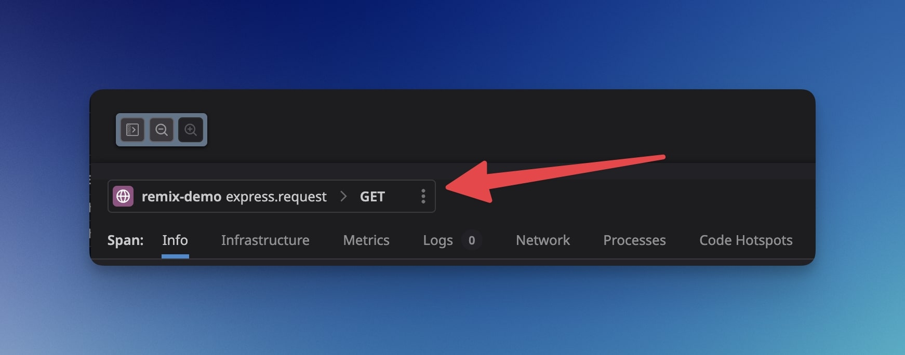

> [!TIP]
> I've released a small package to help improve your Remix traces with Datadog.  
> Have a look at [remix-datadog-express-tracing in npm](https://www.npmjs.com/package/remix-datadog-express-tracing).

# Remix and Datadog app to showcase the current limitations

This repo is a Remix project that reproduces an issue
([originally reported here](https://github.com/DataDog/dd-trace-js/issues/3283#issuecomment-1653821725))
with the [dd-trace](https://github.com/DataDog/dd-trace-js) library version
**4.8.1** where routes handled by Remix using Express in a catch-all route
handler are generating resources named with `GET` only in the APM UI.

https://github.com/brunojppb/remix-datadog-tracing/blob/8a0f09a3f72d2c9d2f12edf2029acad689fe8b0e/server/prod.ts#L7-L13

To resolve this issue for now, use my package: [remix-datadog-express-tracing in npm](https://www.npmjs.com/package/remix-datadog-express-tracing).

## How to reproduce the issue

First install all dependencies with:

```shell
npm install
```

Then, build the app with:

```sh
NODE_ENV=production npm run build
```

Then run the app in production mode enabling the Datadog tracer:

```sh

NODE_ENV=production \
  DD_TRACE_ENABLED=true \
  DD_TRACE_DEBUG=true \
  DD_SERVICE=remix-demo \
  PORT=3000 \
  node --require dd-trace/init ./build/index.js

```

Now visit [http://localhost:3000/demo](http://localhost:3000/demo)

It should trigger a tracing event. If you go to the Datadog UI, you should see
this:



## Docker

This demo includes a Dockerfile which builds a production-ready Docker image
also with dd-trace enabled. Just go ahead and build it:

```shell
docker build .
```

upon running the container, assuming there is a datadog agent available, traces
should start to come in the APM.

### DIY

If you're familiar with deploying express applications you should be right at
home just make sure to deploy the output of `remix build`

- `build/`
- `public/build/`
